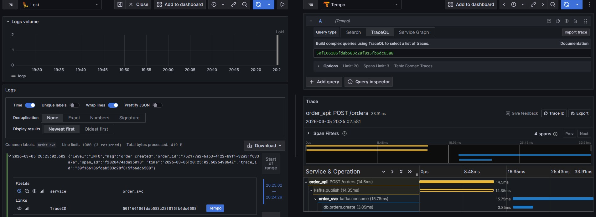

# Order Service (Hexagonal/CQRS + Distributed Observability)
**Status:** Architectural PoC / Being worked on.

[Gist with project analysis](https://gist.github.com/Anacardo89/44471e8ef57e71b11e1c184a6dcfcdb1)

### Technical Highlights:
- **Architecture:** Hexagonal (Ports & Adapters) to decouple core logic from Kafka/gRPC.
- **CQRS:** Write-side via Kafka events; Read-side via gRPC.
- **Observability:** Distributed tracing propagated across service boundaries (Kafka headers + gRPC interceptors). 
- **Stack:** Go, gRPC, Kafka, Loki/Tempo/Prometheus.
- **Deployment:** Deploy in docker with 2 commands inside /deployments/docker `cp sample.env .env` and `docker compose up -d`

### Todo
- Currently handling Kubernetes deployment
- Implement OTel collector to funnel al observability into

